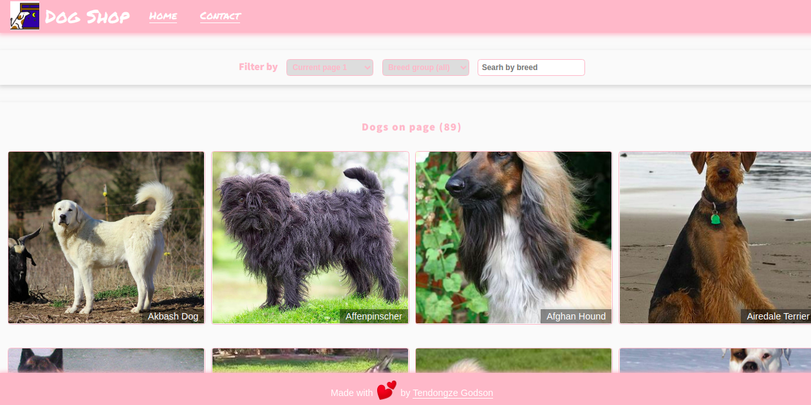

  

# Dog Shop | Dog breeds catalogue

> The <b>Dog Shop</b> web app presents images of dogs and their skills.Items can be filtered by breed or searched by breed name.
>  
> The APP is created latest industry standards using React.js and Redux Toolkit
>  
> API used for fetching data: [TheDogApi](https://thedogapi.com/)
>  
> The app is fully mobile responsive and tested using Jest and the React Testing Library.
>  

## App functionality

- Users view a catalog of dogs and their breed on the homepage.
- Users can change the page number, filter by breed or search by breed name.
- Users can click on an image to be routed to the dog show page where they can see their details: temperament, life span, raised for, breed group, height, and weight. They can click on the Wikipedia link if they are interested to check extra info about the dog.
- The dog show page contains other random dogs sections where users can navigate to see other dogs

## This web app is live, you can check it here: [Live demo](https://tGodson.github.io/Dog-shop/)

## Screenshot of the app.

## Video presentation 

View a video presentation of the app [Here](https://www.loom.com/share/24a5b8d3d99e48308199779da5d33b7e)

## Built With

- React.js
- create-react-app
- Redux Toolkit
- Axios

## Testing
- Jest
- React Testing Library

## Prerequisities

To get this project up and running locally, you must have [node](https://nodejs.org/en/) and [yarn](https://yarnpkg.com/) installed locally.

## Getting Started

**To get this project set up on your local machine, follow these simple steps:**

**Step 1** 
Navigate through the local folder where you want to clone the repository and run 
`git clone https://github.com/tGodson/Dog-shop.git`. It will clone the repo to your local folder. 
**Step 2** 
Run `cd Dog-shop` 
**Step 3** 
Run `yarn install` to install the npm packages from the `package.json` file. 
**Step 4** 
Run `yarn start` to start the webpack server, you can now navigate to `http://localhost:3000` to view the app. The server refreshes the app every time you make a change to a file used by it. 
**Step 5** 
Most importantly, enjoy the app! 

## Tests

1. Open Terminal

2. Install dependencies (only if you did not install them previously):

   `yarn install`

3. Run the tests with the command:

   `yarn test`

## Author

👤 **Tendongze Godson**

- Email: [Email](tendongzegodson@gmail.com)
- Github: [tGodson](https://github.com/tGodson)
- Twitter: [@tendongze95](https://twitter.com/tendongze95)
- Linkedin: [tendongzegodson](https://www.linkedin.com/in/tendongzegodson)

## 🤝 Contributing

Our favourite contributions are those that help us improve the project, whether with a contribution, an issue, or a feature request!

## Show your support

If you've read this far....give us a ⭐️!

## 📝 License

This project is licensed by Microverse and the Odin Project

## Credits

- [Creative Commons license of the design](https://creativecommons.org/licenses/by-nc/4.0/)

Favicon and icons made by <a href="http://www.freepik.com/" title="Freepik">Freepik</a> from <a href="https://www.flaticon.com/" title="Flaticon">www.flaticon.com</a>

<a href="https://www.microverse.org/">Microverse</a> for the module of this project <a href="https://www.notion.so/Catalogue-of-Dog-Clothes-8bf1512b8ab34fa28848beb8ab698a32">Catalogue of Dog Clothes</a>
